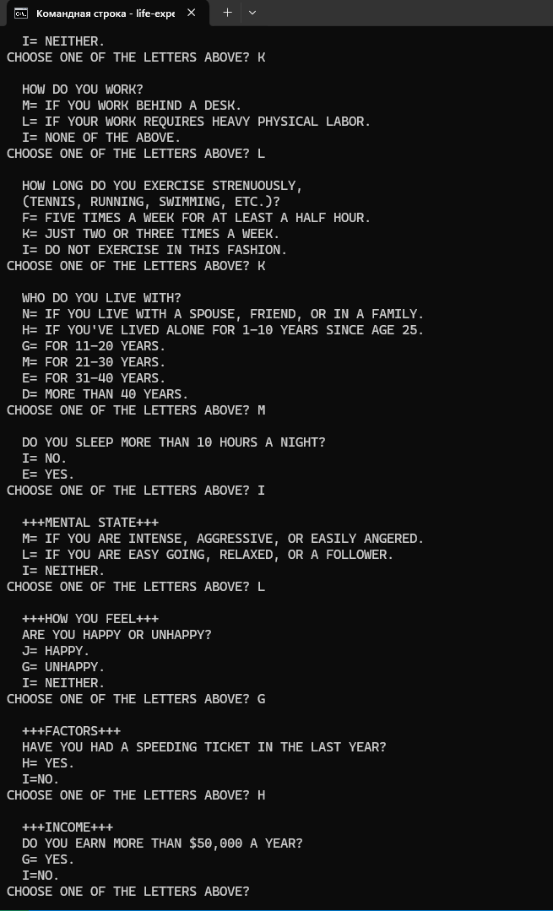

# Семестровый проект по портированию игры на различные платформы
### Автор: Киселёв Максим Алексеевич. Студент группы ИКБО-08-21

# Описание проекта
Этот проект посвящен портированию игры из сборника More BASIC Computer Games на различные платформы, включая Windows, Linux, Web и NetBSD. Целью проекта является обеспечение точности работы портированной версии игры в соответствии с её оригиналом, написанным на Microsoft BASIC. Для запуска оригинальной версии использовался эмулятор Vintage BASIC.

Основной задачей было не только портировать игру, но и создать автоматические тесты, которые подтверждают, что портированная игра ведет себя точно так же, как и оригинальная. Это достигается через набор диалогов между игроком и компьютером, результаты которых сравниваются с эталонными логами оригинальной игры.

Поддерживаемые платформы
Windows
Linux
Web
NetBSD (повышенной сложности)

# Сборка проекта

Для сборки проекта на различных платформах используется утилита make. 
Ниже приведены команды для каждой из поддерживаемых платформ.

#### Windows
mingw32-make windows

#### Linux
make linux

#### Web
make web

#### NetBSD
make netbsd

# Примеры работы проекта

Для демонстрации работы портированной игры прилагаются примеры запуска на различных платформах:

#### Windows:

#### Linux:

#### Web:

#### NetBSD: 

# Автоматическое тестирование

# История разработки

Разработка велась в публично доступном Git-репозитории. Весь ход проекта зафиксирован в коммитах с подробными сообщениями, отражающими прогресс работы.

# Заключение

Этот проект является демонстрацией возможностей кроссплатформенного портирования старинных игр, выполненного с соблюдением требований оригинала и автоматического тестирования.
